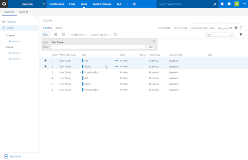
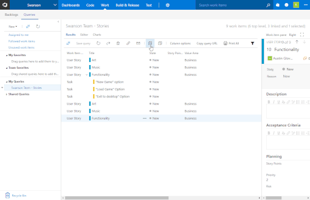

# Work Item Print

Visual Studio Team Services and Team Foundation Server don't make it easy to print work items. This extension will allow printing of single work items, selected multiple work items, or all items in a query. Limit is ~330 work items at once.

## Print a Single Work Item

Right-click on a work item and select `Print`:

`OR`

Select `Print` from the work item form menu:

## Print Multiple Work Items

Select several work items **(works in backlog and queries)**, then right-click and select `Print Selection`:

## Print All From Query

Run a query, then select `Print All` from the toolbar:

## Planned but not implemented

* Selecting which fields are printed
* Better print template

### [Code contributions are welcome](https://github.com/mrtarantula/wiprint)

## Changelog

### v1.0.3

* Added `Acceptance Criteria` field
* Minor code improvements
