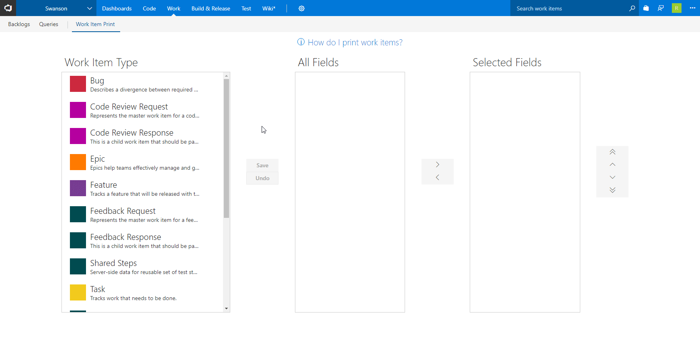
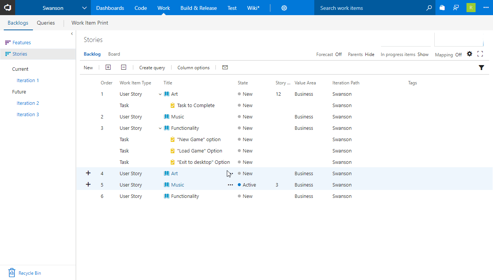
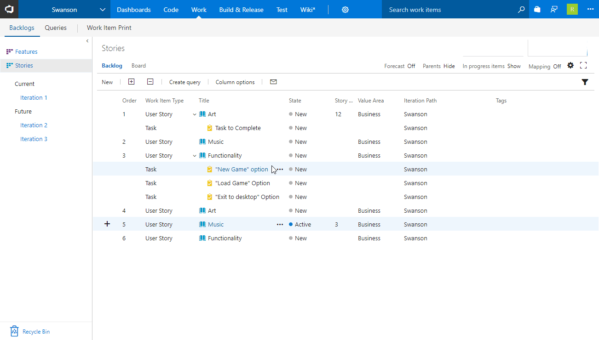
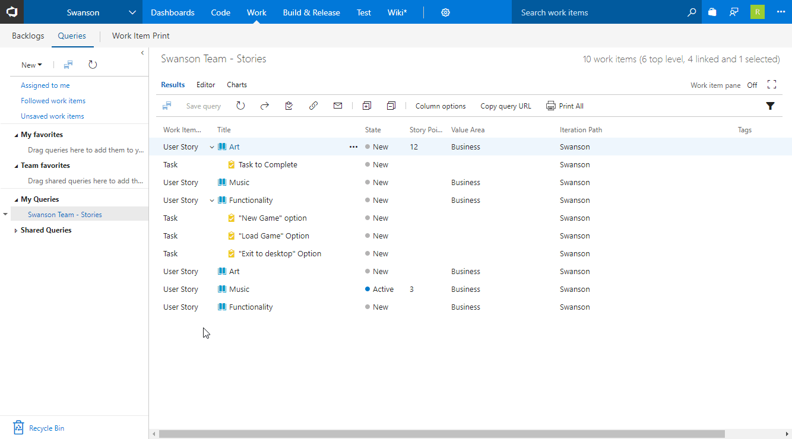

# Work Item Print

Visual Studio Team Services and Team Foundation Server don't make it easy to print work items. This extension will allow printing of single work items, selected multiple work items, or all items in a query. Limit is ~330 work items at once.

## Configure Printing  -  **`NEW in V2.0`** 

A new configuration screen has been added. Select a work item type, choose the fields you want to print, put them in order, and then save. Then print your work items. Configuration is per user.

## Print a Single Work Item

Right-click on a work item and select `Print`:

***OR***

Select `Print` from the work item form menu:

## Print Multiple Work Items

Select several work items **(works in backlog and queries)**, then right-click and select `Print Selection`:

## Print All From Query

Run a query, then select `Print All` from the toolbar:

## Print Query Without Running

Right-click on a query and select `Print All`.

### [Code contributions are welcome](https://github.com/mrtarantula/wiprint)

## Changelog

### v2.2.21

* Fixed bug due to VSTS API change. Dropped support for TFS 2015
### v2.2.3

* Added a small delay to allow images to load before printing.
### v2.2.2

* VSTS API broke conversation history. Fixed.

### v2.2.1

* Added conversation history

### v2.0.5

* Fixed bug when printing from work item form in IE

### v2.0.4

* Fixed broken string sanitization

### v2.0.3

* Added double-click functionality to field picker
* Field picker scrolls to newly added field
* Fixed bug that prevented printing from board
* Fixed bug where saving wasn't enabled when only sorting fields
* Fixed bug where Undo button wasn't clearing the selected field

### v2.0.2

* Fixed a bug not allowing special characters in work item field names/ids

### v2.0.1

* Workaround for strings incorrectly being parsed as bad dates, resulting in missing fields

### v2.0.0

* Added per-work-item configuration
* Fixed bug when printing in IE
* Automatically hide fields that don't have a value set

### v1.0.4

* Removed explicitly set fields

### v1.0.3

* Added `Acceptance Criteria` field
* Minor code improvements
